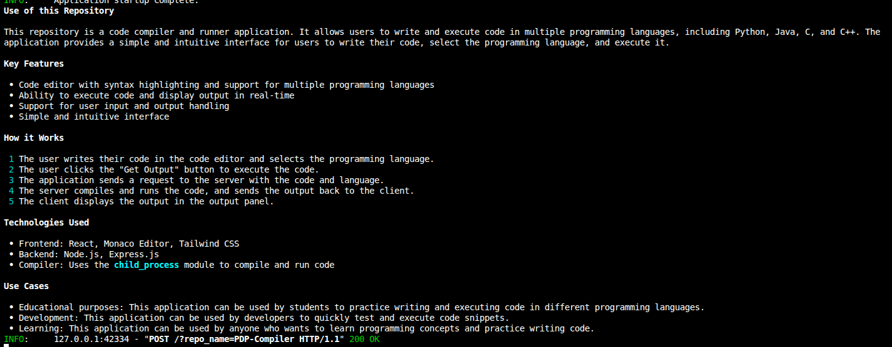

# GitHub ReadMe Agent


A smart tool that automatically generates README files for your GitHub repositories using AI.

## What Does It Do?

This project uses artificial intelligence to analyze your code and create a clear, easy-to-understand README file. You just provide your GitHub repository, and the tool will:

1. **Fetch your code** - Downloads all JavaScript files from your GitHub repo
2. **Analyze the code** - Uses AI to understand what your code does
3. **Generate a README** - Creates a simple English explanation of your project

## How to Use

### Requirements

- Python 3.12 or higher
- GitHub personal access token - **Fine-grained personal access tokens** (create one at [github.com/settings/personal-access-tokens/new](https://github.com/settings/personal-access-tokens/new))
  - When creating the token, set **Repository access** to "All repositories" to allow access to all your repos
  - Grant **Contents** permission (read access)
  - **The token is used only for the current request and is not stored anywhere**
- Groq API key (for the AI model)

### Installation

1. Clone the repository
2. Install dependencies:

```bash
uv install
```

3. Create a `.env` file with your API keys:

```
GROQ_API_KEY=your_groq_api_key_here
```

### Running the Application

Start the server:

```bash
uvicorn main:app --reload
```

The server will run on `http://localhost:8000`

### Making a Request

Send a POST request to generate a README using curl or Postman to get the output in the terminal:

```bash
curl -X POST "http://localhost:8000/?repo_name=your-repo-name" \
  -H "Authorization: Bearer your-github-token"
```

The response will contain the AI-generated README for your repository.

## Technologies Used

- **FastAPI** - Web framework for the API
- **LangChain** - AI framework for working with language models
- **Groq** - Fast AI model provider
- **Rich** - Beautiful formatting for output
- **GitHub Loader** - Fetches code from GitHub repositories

## Example

If you have a repository with JavaScript files, the agent will read them all and generate a description like:

> "This repository contains a web application that manages user data. It includes authentication, database operations, and API endpoints for CRUD operations..."

## Notes

- Currently supports JavaScript/JSX files
- Requires a valid GitHub access token
- Uses the Groq API with Llama 3.3 model for AI analysis
